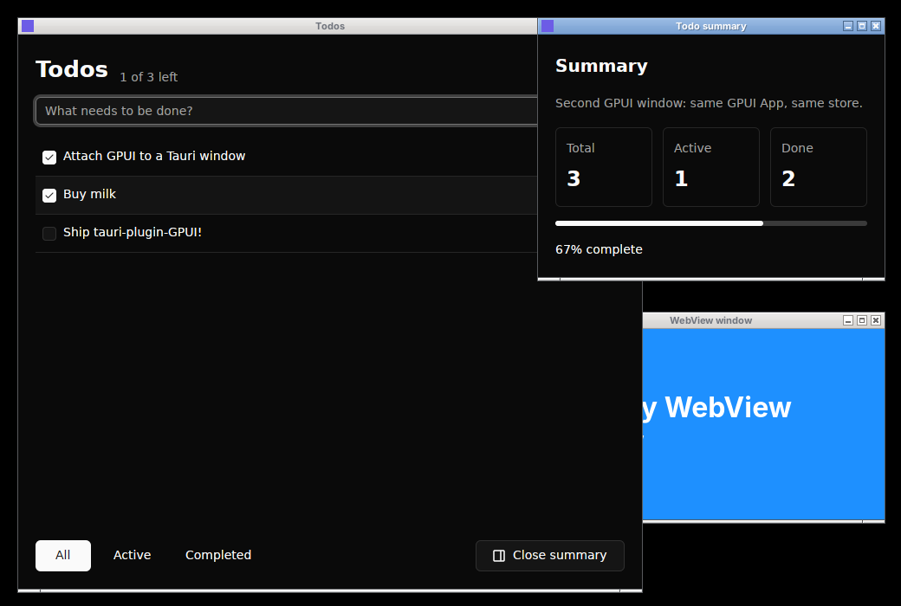

# tauri-plugin-gpui

Render [GPUI](https://www.gpui.rs) views inside ordinary Tauri windows, with no WebView.

Tauri/TAO keeps ownership of the application lifecycle, the event loop and native windows. The plugin permanently attaches GPUI as the content renderer of an existing Tauri window. Every attached window shares one GPUI `App` that runs on Tauri's event-loop thread. GPUI-backed windows and ordinary WebView windows can run side by side in the same app. See [`PRD.md`](PRD.md) for the design.



*Taken by `tauri-plugin-screenshots` during the automated demo run. `Todos` and `Todo summary` are Tauri windows rendered by GPUI with [gpui-kit](https://crates.io/crates/gpui-kit) components, sharing one to-do store; `WebView window` is a normal Tauri/Wry window.*

## Usage

```toml
[dependencies]
tauri = { version = "2.12", features = ["unstable"] } # `unstable` enables tauri::WindowBuilder
tauri-plugin-gpui = { git = "https://github.com/ziinc/tauri-gpui" }
```

```rust
use tauri_plugin_gpui::{GpuiWindowExt, gpui::{self, prelude::*}};

struct Hello;

impl gpui::Render for Hello {
    fn render(&mut self, _: &mut gpui::Window, _: &mut gpui::Context<Self>) -> impl IntoElement {
        gpui::div().size_full().child("Hello from GPUI")
    }
}

fn main() {
    tauri::Builder::default()
        .setup(|app| {
            tauri_plugin_gpui::init(app)?;

            let window = tauri::WindowBuilder::new(app, "main").title("Example").build()?;
            window.attach_gpui(|cx| cx.new(|_| Hello))?;
            Ok(())
        })
        .run(tauri::generate_context!())
        .expect("error while running tauri application");
}
```

- `tauri_plugin_gpui::init(app)` / `init_with(app, GpuiConfig)` is called from `setup` instead of going through `Builder::plugin`. The plugin needs raw TAO events, and Tauri only exposes those through `App::wry_plugin`. `GpuiConfig` lets you set a fallback font, a GPUI `AssetSource` and an `on_launch(|cx| …)` hook for app-level GPUI setup (globals, key bindings, fonts).
- `window.attach_gpui(|cx| …)` / `attach_gpui_with(GpuiOptions, …)` is a one-way call for the life of the window. A second call returns `GpuiError::AlreadyAttached`. A window that hosts a WebView returns `GpuiError::NotEligible`. You can call it from inside GPUI code, such as a click handler that builds a new Tauri window; the mount then finishes as soon as the current GPUI update returns.
- `attach_gpui_view(GpuiOptions, |window, cx| …)` also passes the GPUI `Window` to the root builder. Component libraries need it to wrap content in their root view, for example gpui-kit's `base::Root::new(view, window, cx)`.
- `tauri_plugin_gpui::with_app(|cx| …)` gives main-thread code outside GPUI access to the shared `App`. It returns `GpuiError::Reentrant` instead of panicking when the `App` is already borrowed.
- To open more windows, use Tauri: build the window with `tauri::WindowBuilder`, then call `attach_gpui`. GPUI's `cx.open_window(…)` returns `unsupported operation: open_window …`.
- When a Tauri window is destroyed, its GPUI root, renderer and surface are destroyed with it. If GPUI removes a window itself (`window.remove_window()`), the plugin asks Tauri to close the native window. Closing the last GPUI window leaves the shared `App` running, and a later window can attach to it again.

## How it works

| Concern | Implementation |
|---|---|
| Event loop | A `tauri_runtime_wry::Plugin` taps TAO events on Tauri's thread. GPUI never runs a loop of its own. |
| GPUI `App` | `Application::with_platform(TauriPlatform)` plus `run_embedded`: one `App` per Tauri app, deliberately leaked so it lives until the process exits. |
| Task scheduling | A custom `PlatformDispatcher`. Main-thread runnables go into a queue that is drained from the TAO callback. Wakeups are posted through the TAO event-loop proxy. Background work runs on a worker pool and timers on their own thread. |
| Window creation | `Platform::open_window` only accepts the surface `attach_gpui` prepared. Every other call fails explicitly. |
| Rendering | `gpui_wgpu::WgpuRenderer` is built on the Tauri window's raw window and display handles (Vulkan/GL on Linux, Metal on macOS, DX12 on Windows). Text uses `gpui_wgpu::CosmicTextSystem`. |
| Redraw | Demand-driven. GPUI's `frame_waker`/`schedule_frame` set a per-window flag and wake TAO. Pending frames are delivered at `MainEventsCleared`. TAO `RedrawRequested` (expose, resize) forces a present. An idle app uses 0% CPU. |
| Input | TAO `WindowEvent` is translated to GPUI `PlatformInput` (see below). |
| Window management from GPUI | `set_title`, `activate`, `minimize`, `zoom`, `toggle_fullscreen`, `resize` and cursor styles are forwarded to the Tauri `Window` API and run outside GPUI updates. |

### Event coverage

Handled: resize, scale-factor change, move, focus, cursor enter/leave/move, mouse buttons with click counting, mouse wheel (line and pixel deltas), keyboard down/up with repeat, modifier and caps-lock state, IME commit text, theme change, and destroy (teardown).

`RedrawRequested` forces a present.

Keystrokes follow GPUI naming (`enter`, `left`, `f5`, lowercase characters). `key_char` comes from TAO's shift-aware logical key. When a TAO backend sends the same typed character twice (once as a key press, once as an IME commit), the duplicate is dropped.

## Minimal platform adapter: Phase 0 findings

The spike's central question was whether GPUI can render into an existing Tauri/TAO window without forking either project. The answer is yes. The plugin builds on [`gpui-pre`](https://crates.io/crates/gpui-pre) 0.3.8 and `gpui-pre-wgpu`, crates.io snapshots of zed's GPUI and the same crates gpui-kit and gpui-component use, renamed to `gpui`/`gpui_wgpu` in `Cargo.toml`. That GPUI exposes `Platform`, `PlatformWindow`, `PlatformDispatcher`, `Application::with_platform` and `Application::run_embedded`, and `gpui-pre-wgpu` exposes a renderer that accepts raw window handles. The crates.io `gpui` 0.2.x keeps `Platform` crate-private, so it cannot be used.

The pin is exact (`=0.3.8`), because every crate in a GPUI app must share one GPUI version. If you use gpui-kit, use a release built on the same `gpui-pre` (gpui-kit 0.7.1 is).

What GPUI needs for rendering and interaction:

- **Platform:** executors and dispatcher, text system, `run` (returns immediately), `open_window`, displays (the primary monitor via Tauri), `active_window`, cursor style, keyboard layout and mapper (US layout and the dummy mapper).
- **PlatformWindow:** geometry, scale factor and appearance getters; the input handler; the `on_*` callback registrations; `draw`, `sprite_atlas` and `frame_waker`/`schedule_frame`.

Everything else does one of three things:

- **Delegated to Tauri:** `quit`, `restart`, and the window title, focus, minimize, maximize, fullscreen and resize operations.
- **Explicitly unsupported:** these return `GpuiError::UnsupportedOperation` through `anyhow`, or are logged at debug level when the GPUI signature has no error channel.
  - Windows: `open_window` outside `attach_gpui`, non-normal window kinds, background appearance (blur/transparency).
  - System integration: clipboard (including the primary selection), credentials, menus and dock menus, path prompts (use `tauri-plugin-dialog`), `open_url` (use `tauri-plugin-opener`), URL schemes, `reveal_path`/`open_with_system`, app hide/unhide, idle-sleep prevention.
  - Input and accessibility: IME candidate positioning, accessibility (AccessKit).
- **Handled by GPUI's built-in fallback:** prompts (`PlatformWindow::prompt` returns `None`).

## Platform status

| Target | Status |
|---|---|
| Linux (X11) | Verified end to end by the screenshot test below (Xvfb, Mesa lavapipe Vulkan). |
| Linux (Wayland) | Builds. TAO hands out Wayland handles, but the GTK subsurface interaction has not been tested. |
| macOS, Windows | Implemented against the same cross-platform APIs but **not yet built or run**. On Windows, `tauri-runtime-wry` paints window-only windows with softbuffer, which may conflict with the DX12 swapchain. |
| iOS, Android (`mobile` feature) | The `mobile` feature pulls in `gpui-mobile` and is off by default, so desktop builds never compile it. The published `gpui-mobile` 0.1 does not yet include its `Platform` implementations, so `init`/`attach_gpui` return `UnsupportedOperation` on mobile targets. The public API is the same as on desktop. |

## Example and screenshot testing

[`examples/gpui-demo`](examples/gpui-demo) is the PRD's sample application: a to-do list built with [gpui-kit](https://crates.io/crates/gpui-kit) components (Input, Checkbox, Button, Progress, light/dark theme). It contains:

- a GPUI-backed `main` window with the to-do list: add, check off, delete and filter, plus a theme toggle;
- a `summary` window that a GPUI click handler creates, closes and recreates. It shows live stats from the same store;
- an ordinary WebView window.

```sh
# needs: Xvfb, openbox (or another EWMH WM), xdotool, a Vulkan driver (mesa-vulkan-drivers)
examples/gpui-demo/scripts/screenshot-test.sh [output-dir]
```

With `GPUI_DEMO_AUTOTEST=<dir>` set, the demo:

1. drives real X11 input with `xdotool` (X11 → GTK → TAO → plugin → GPUI);
2. asserts on GPUI state for each PRD success criterion;
3. captures every window with [`tauri-plugin-screenshots`](https://crates.io/crates/tauri-plugin-screenshots);
4. writes `report.json` and exits non-zero if any check fails.

## Remaining open questions

- GPUI versioning: the crate tracks the `gpui-pre` snapshots, the same ones gpui-kit tracks, until upstream publishes a `gpui` with a public `Platform`.
- Clipboard and IME positioning. Neither has a Tauri core API: clipboard is available through `tauri-plugin-clipboard-manager`, and IME positioning would need a TAO change.
- Accessibility (AccessKit through Tauri windows).
- Building and testing on macOS and Windows.
- Mobile, once `gpui-mobile` publishes its platform layer.
